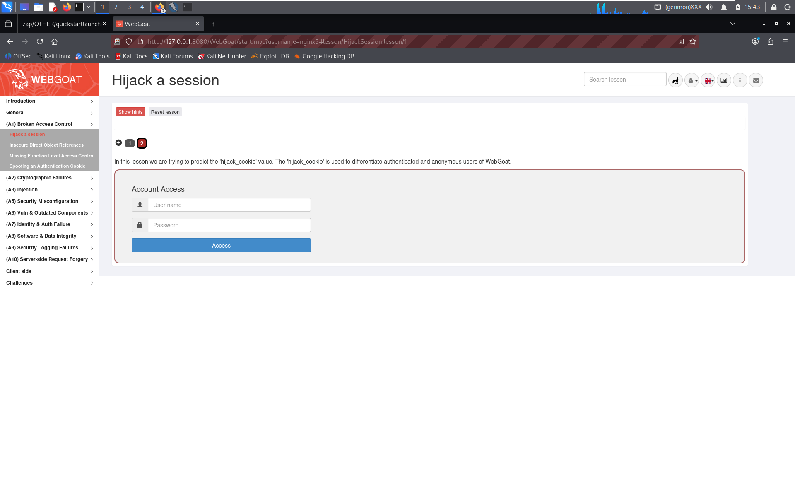
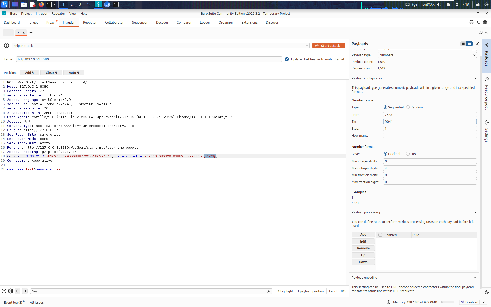
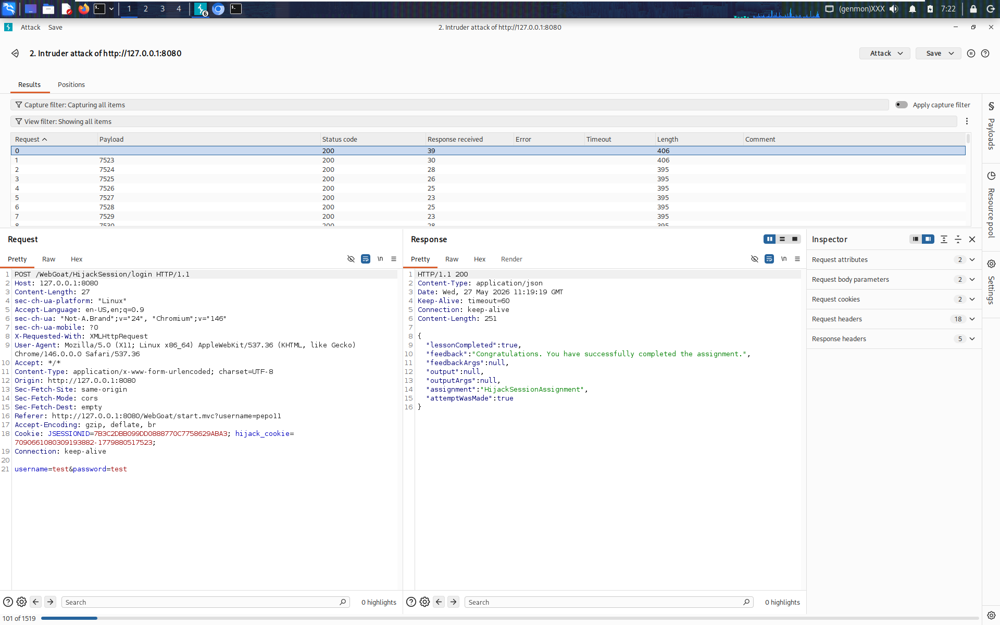

# Hijack a Session — WebGoat Lesson: A1 Broken Access Control

**Category:** A1 — Broken Access Control
**Difficulty:** Medium

## Objective

WebGoat authenticates and tracks users with a custom `hijack_cookie`, separate from the standard `JSESSIONID`. The lesson's goal is to prove that this cookie is predictable, then use a guessed/forged value to hijack another user's authenticated session without knowing their credentials.



## Vulnerability

The `hijack_cookie` is generated using a weak, guessable scheme rather than a cryptographically random token. Looking at a captured cookie:

```
hijack_cookie=7090661080309193882-1779880517523
```

The value is structured as `<some-fixed-looking-prefix>-<number>`, where the trailing number falls inside a small, predictable numeric range (timestamp/counter-like). Because the "random" component is really just a sequence of numbers within a narrow band, it can be brute-forced rather than needing to be cryptographically broken.

This is a textbook **broken access control / insecure session management** issue: the server trusts a client-supplied token to represent "this request belongs to an authenticated user" without ensuring that token is unpredictable and unforgeable.

## Exploitation Steps

1. Logged into WebGoat normally and intercepted the `POST /WebGoat/HijackSession/login` request in **Burp Suite**, capturing my own valid `hijack_cookie` value alongside `JSESSIONID`.
2. Sent the request to **Burp Intruder** and marked the numeric suffix of the `hijack_cookie` (e.g. the `7523` portion in `...1779880517523`) as the payload position.
3. Configured a **Sniper attack** with a **Numbers** payload type:
   - Type: Sequential
   - From: `7523`
   - To: `9041`
   - Step: `1`
   This generates ~1,519 requests, each with the suffix incremented by one, replaying the login/session-check request with each candidate cookie.

   

4. Ran the attack and reviewed the **Results** tab, sorting/scanning by response length and status code to spot an outlier response.
5. Found the request where the response body confirmed success:
   ```json
   {
     "lessonCompleted": true,
     "feedback": "Congratulations. You have successfully completed the assignment.",
     "assignment": "HijackSessionAssignment",
     "attemptWasMade": true
   }
   ```
   This came back with a distinct `Length: 406` compared to the `395`-length failure responses around it — the length difference was the visual tell that this candidate cookie was accepted as a valid hijacked session.

   

## Why It Worked

- The application distinguishes valid sessions using a client-visible cookie value instead of an opaque, high-entropy, server-side-validated session token.
- The numeric portion of the cookie lives in a small enough range that automated brute-forcing (only ~1,500 requests) finds a valid value in seconds.
- There's no rate-limiting or lockout on repeated failed `hijack_cookie` attempts, so Burp Intruder could iterate through the full range unthrottled.
- Response length/content differences between "cookie rejected" and "cookie accepted" leak exactly when a guess succeeds, making the attack trivially observable.

## Remediation

- Use a cryptographically secure random token (e.g. UUIDv4 or a securely generated random string ≥128 bits of entropy) for any session-identifying cookie — never a predictable counter or timestamp-derived value.
- Rely on a single, well-vetted session mechanism (framework-provided `JSESSIONID` handling with proper `Secure`, `HttpOnly`, and `SameSite` flags) rather than inventing a second, custom session cookie.
- Implement rate-limiting / account lockout / anomaly detection on repeated failed authentication or session-validation attempts to make brute-forcing infeasible in practice.
- Ensure success/failure responses don't leak distinguishable signals (identical response shape and timing regardless of whether the guess was close or not).

## References

- [OWASP Top 10 2021 – A01: Broken Access Control](https://owasp.org/Top10/A01_2021-Broken_Access_Control/)
- [CWE-330: Use of Insufficiently Random Values](https://cwe.mitre.org/data/definitions/330.html)
- [CWE-384: Session Fixation](https://cwe.mitre.org/data/definitions/384.html)
