# Insecure Direct Object References (IDOR) — WebGoat Lesson: A1 Broken Access Control

**Category:** A1 — Broken Access Control
**Difficulty:** Medium

## Objective

This multi-stage lesson teaches Insecure Direct Object Reference (IDOR) vulnerabilities: cases where an application exposes an internal reference (like a database ID) directly to the user, and fails to check whether the currently logged-in user is actually authorized to access the object that ID points to. The lesson walks through: authenticating, spotting hidden fields in a raw API response, finding an alternate URL pattern to view your own profile by ID, then using that same pattern to view — and eventually **edit** — another user's profile without permission.

## Vulnerability

The `/WebGoat/IDOR/profile/{userId}` endpoint takes a raw numeric `userId` directly from the URL and returns/updates the profile matching that ID — with **no server-side check** that the `userId` in the request actually belongs to the currently authenticated session. Since the ID is just a predictable-ish number, any authenticated user can substitute someone else's ID and read or modify their data.

## Exploitation Steps

### Stage 1 — Authenticate

Logged in with the credentials provided by the lesson (`tom` / `cat`).

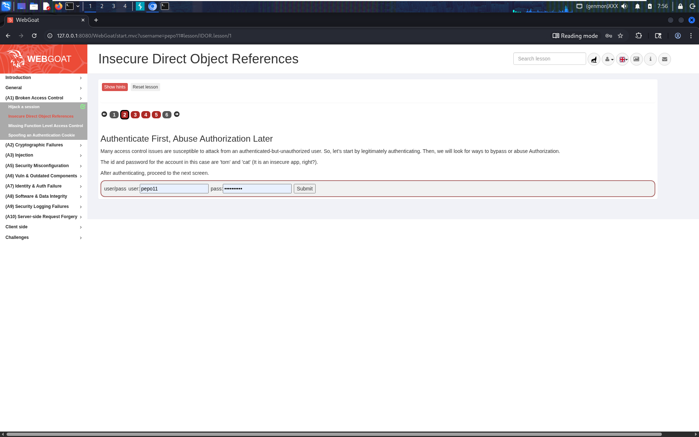
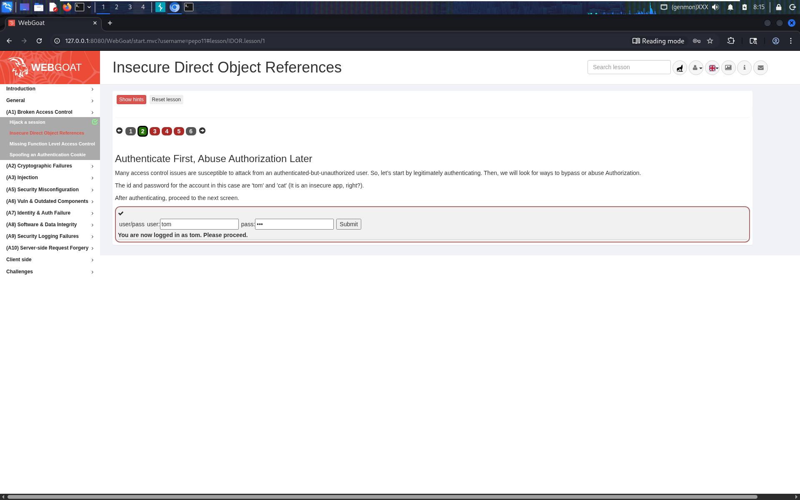

### Stage 2 — Observing Differences & Behaviors

The lesson asks you to view your own profile and compare what's **displayed on screen** versus what's actually **in the raw HTTP response**. Using Burp Suite's Repeater against `GET /WebGoat/IDOR/profile`, the full JSON response showed two fields never rendered in the UI:

```json
{
  "role": 3,
  "color": "yellow",
  "size": "small",
  "name": "Tom Cat",
  "userId": "2342384"
}
```

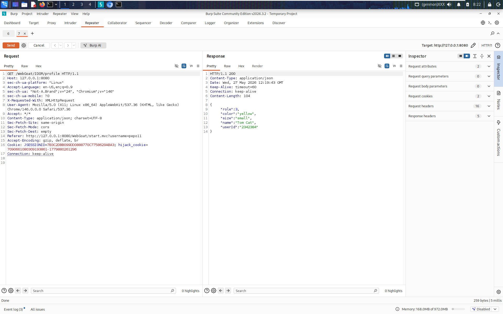

I identified `role` and `userId` as the two extra fields present in the response but absent from the page — submitted as the answer and confirmed correct.

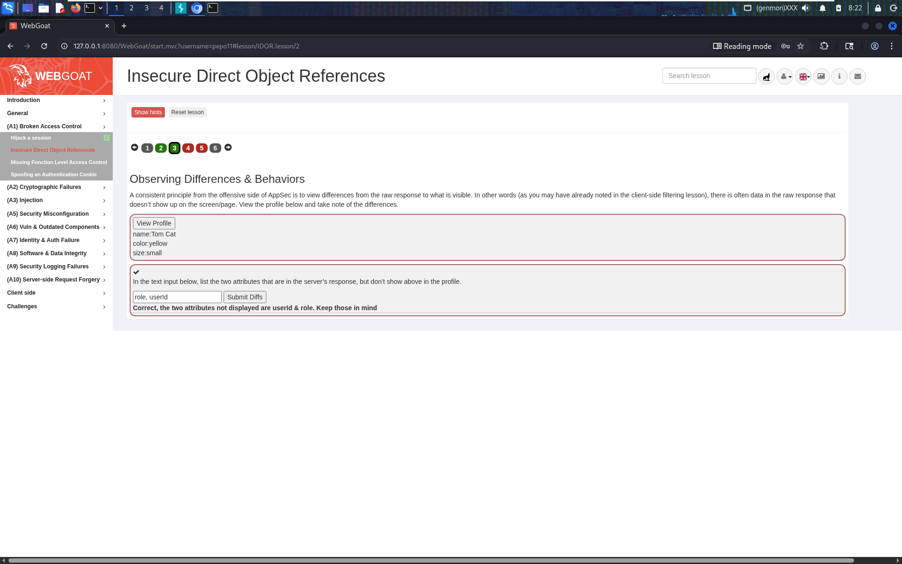

This step matters because it's what tips you off that `userId` exists and is a plain, guessable integer — the actual key to the vulnerability.

### Stage 3 — Guessing & Predicting Patterns

Since the app follows a RESTful style, the lesson asks you to predict the URL pattern for viewing your own profile *by ID* rather than the generic `/profile` endpoint. Based on the `userId` discovered above, I submitted:

```
WebGoat/IDOR/profile/2342384
```

This returned my own profile data directly, confirming the RESTful pattern `/WebGoat/IDOR/profile/{userId}`.

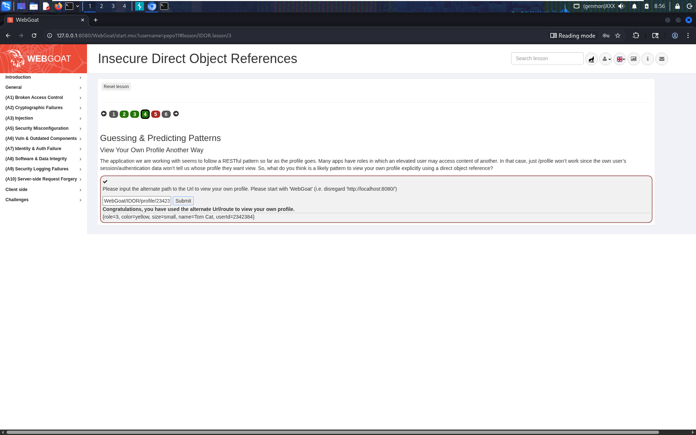

### Stage 4 — View Another Profile (IDOR via ID brute-forcing)

Now the actual IDOR: view a *different* user's profile (Buffalo Bill) just by changing the ID in the URL — with no authorization check stopping me.

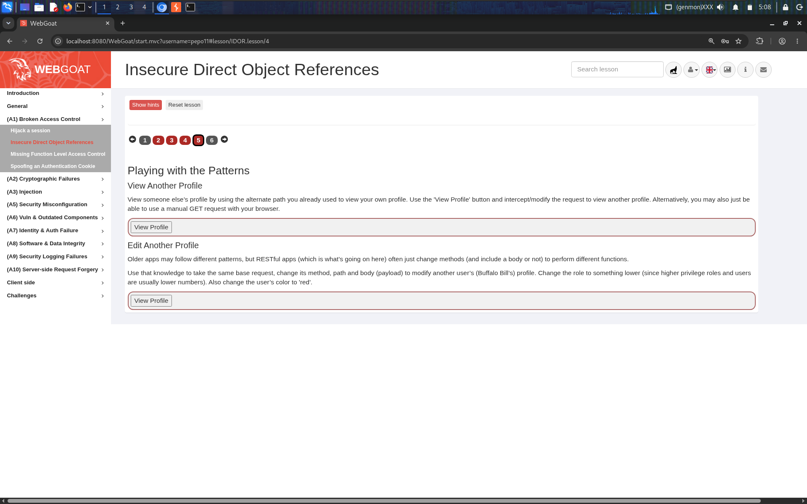

First attempt sent the request with a literal, un-substituted placeholder (`%7BuserId%7D`) by mistake — which correctly failed:


I then tried guessing nearby IDs manually (e.g. `2342384`, off by a small increment) — some guesses failed:

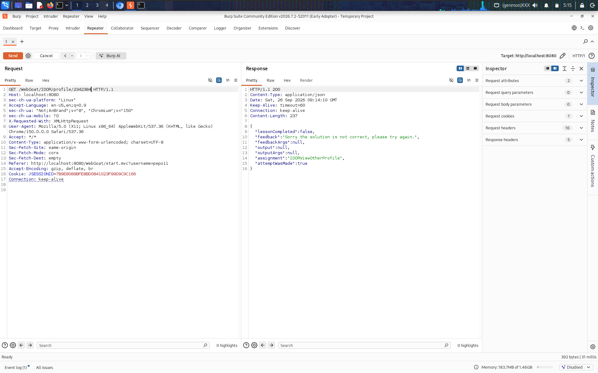

Since my own ID was `2342384` and other lesson users are typically registered close together, I used **Burp Intruder** with a Sniper attack, targeting the last two digits of the ID and sweeping a small numeric range (`84` to `100`):

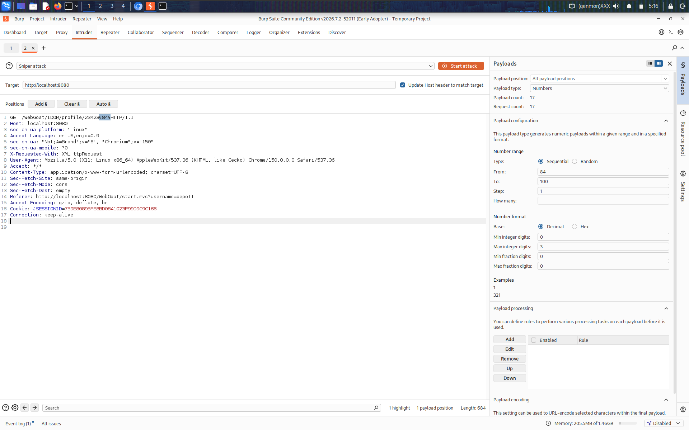

Sorting the Intruder results by response length, one request stood out with a longer response (`448` bytes vs. the `384`-byte failures around it) — `userId = 2342388` returned another user's full profile:

```json
{
  "role": 3,
  "color": "brown",
  "size": "large",
  "name": "Buffalo Bill",
  "userId": "2342388"
}
```

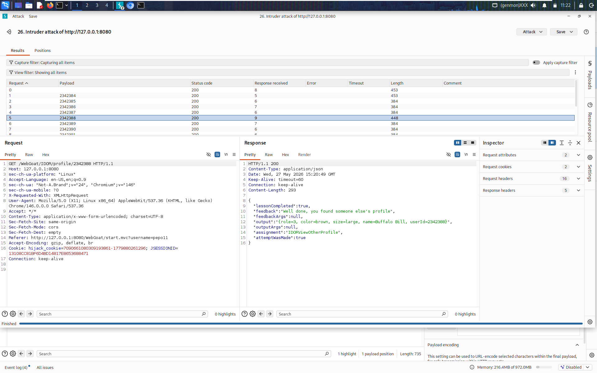

Confirmed the same result cleanly via a direct Repeater request:

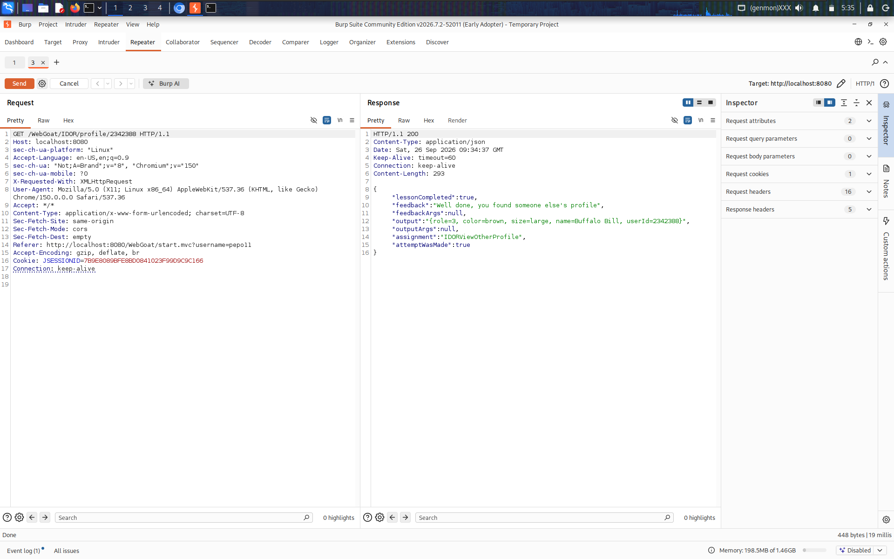

### Stage 5 — Edit Another Profile

The final stage escalates from *reading* another user's data to *modifying* it. RESTful APIs often reuse the same path but switch HTTP method to perform a different action — so I changed the request method from `GET` to `PUT`, targeting the same `userId=2342388`, with a modified JSON body lowering the role and changing the color as instructed by the lesson:

```http
PUT /WebGoat/IDOR/profile/2342388 HTTP/1.1
Content-Type: application/json

{
  "role": 1,
  "color": "red",
  "size": "large",
  "name": "Buffalo Bill",
  "userId": 2342388
}
```

The server accepted the update with no authorization check on whether the requester was allowed to modify that profile:

```json
{
  "lessonCompleted": true,
  "feedback": "Well done, you have modified someone else's profile (as displayed below)",
  "output": "{role=1, color=red, size=large, name=Buffalo Bill, userId=2342388}",
  "assignment": "IDOREditOtherProfile",
  "attemptWasMade": true
}
```

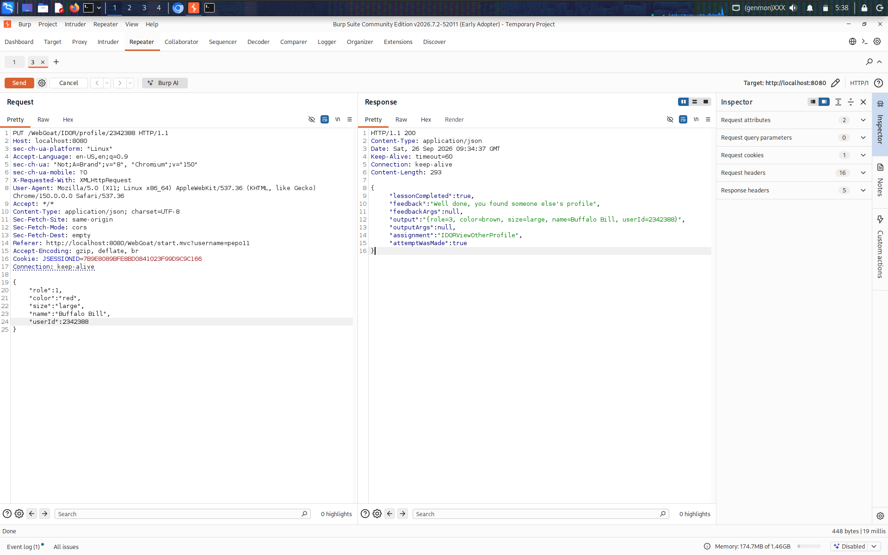

Lesson fully completed:

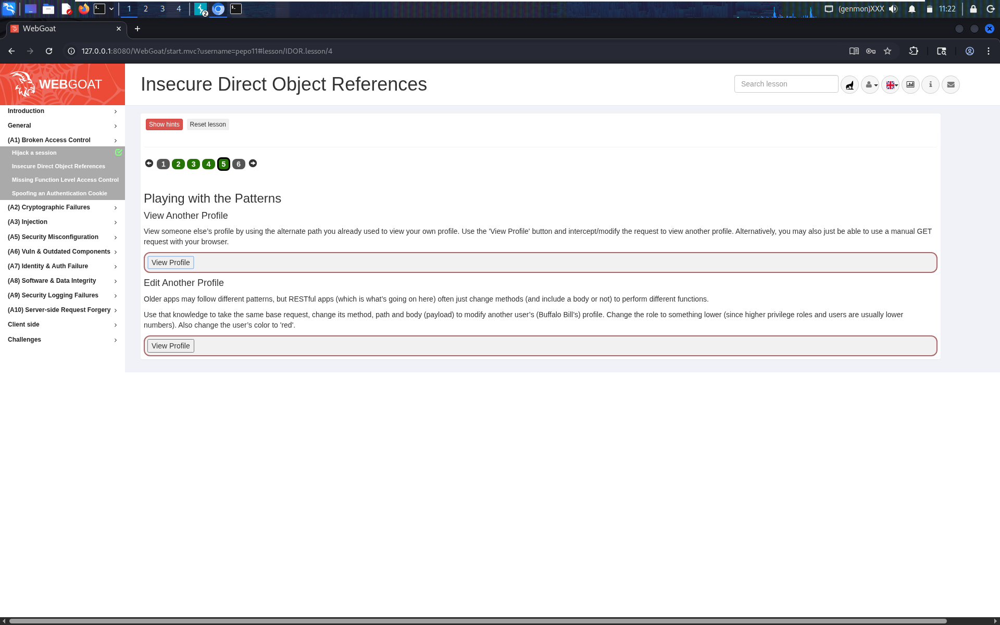

## Why It Worked

- **No ownership check**: the server trusted the `userId` supplied in the URL/body instead of deriving "whose profile is this?" from the authenticated session (`JSESSIONID`/user context).
- **Predictable, sequential IDs**: user IDs were plain incrementing integers clustered in a narrow range, making them trivially brute-forceable with Burp Intruder (only ~17 requests needed).
- **Same vulnerability class enabled both read and write**: because the endpoint's authorization logic (or lack thereof) didn't differentiate between GET and PUT, the exact same missing check that leaked another profile's data also allowed modifying it.
- **Verbose responses**: the raw JSON exposed internal fields (`role`, `userId`) never intended for client-side display, giving away the data model needed to construct the attack in the first place.

## Remediation

- Enforce **object-level authorization** on every request: verify server-side that the authenticated user actually owns (or has explicit permission for) the `userId` being accessed or modified — never trust a client-supplied ID alone.
- Avoid exposing sequential, guessable primary keys in URLs/APIs; use non-guessable identifiers (UUIDs) where the ID must be client-visible, though this is a mitigation, not a substitute for proper authorization checks.
- Apply the principle of least exposure: don't return internal fields (like `role`) in API responses unless the client genuinely needs them.
- Rate-limit and monitor for sequential ID enumeration patterns (many requests differing only by an incrementing path parameter) to catch brute-force attempts like the Intruder sweep used here.
- Apply the same authorization check consistently across all HTTP methods (GET, PUT, DELETE, PATCH) for a given resource — a check present only on reads (or only on writes) leaves the other half of the CRUD surface exposed.

## References

- [OWASP Top 10 2021 – A01: Broken Access Control](https://owasp.org/Top10/A01_2021-Broken_Access_Control/)
- [CWE-639: Authorization Bypass Through User-Controlled Key](https://cwe.mitre.org/data/definitions/639.html)
- [OWASP IDOR Prevention Cheat Sheet](https://cheatsheetseries.owasp.org/cheatsheets/Insecure_Direct_Object_Reference_Prevention_Cheat_Sheet.html)
