# Missing Function Level Access Control — WebGoat Lesson: A1 Broken Access Control

**Category:** A1 — Broken Access Control
**Difficulty:** Hard

## Objective

This lesson demonstrates **Missing Function Level Access Control**: functionality that should be restricted to a specific role (here, admin-only user management) is reachable by any user simply because the server never actually checks who's calling it — it only relies on the UI hiding the links. The lesson escalates in three stages: find the hidden admin functionality, abuse it directly, then — after the app applies a supposed "fix" — bypass that fix using a **mass assignment** flaw.

## Vulnerability

Two separate, chained flaws:

1. **Missing server-side authorization**: admin-only endpoints (`/WebGoat/access-control/users`, and later `/WebGoat/access-control/users-admin-fix`) were only "protected" by hiding their links from the UI for non-admin users (security through obscurity). The server never verified the caller's role before returning the data.
2. **Mass assignment / over-posting**: after the app added a real authorization check, a related endpoint that updates/creates user records still blindly trusted whatever JSON fields the client sent — including an `"admin": true` field — letting a normal user grant themselves (or manipulate) admin status client-side.

## Exploitation Steps

### Stage 1 — Relying on Obscurity: Finding Hidden Menu Items

The lesson explains that the app tries to hide admin functionality purely via the UI (no visible links), and asks you to find two hidden menu items.

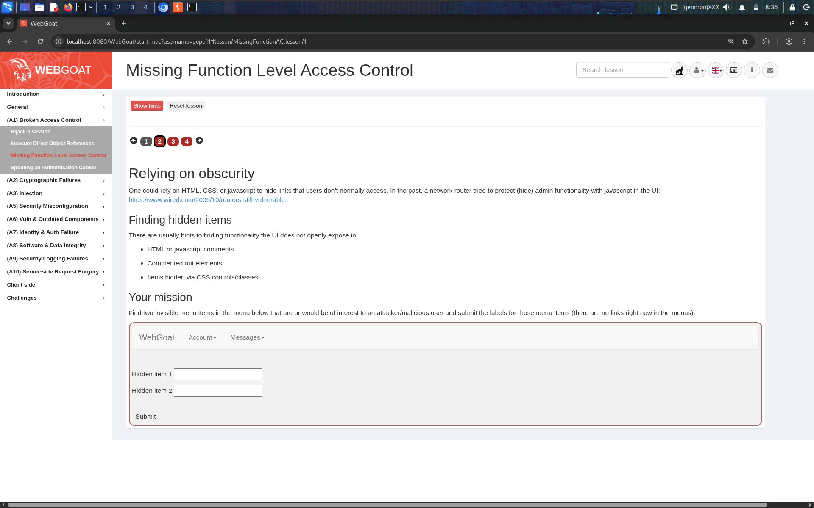

Opened Chrome DevTools and inspected the navbar's DOM directly, under the hidden `<li class="hidden-menu-item dropdown">` element. This revealed two `<a>` tags never rendered visibly, pointing to real backend paths:

```html
<a href="access-control/users-admin-fix">Users</a>
<a href="access-control/config">Config</a>
```

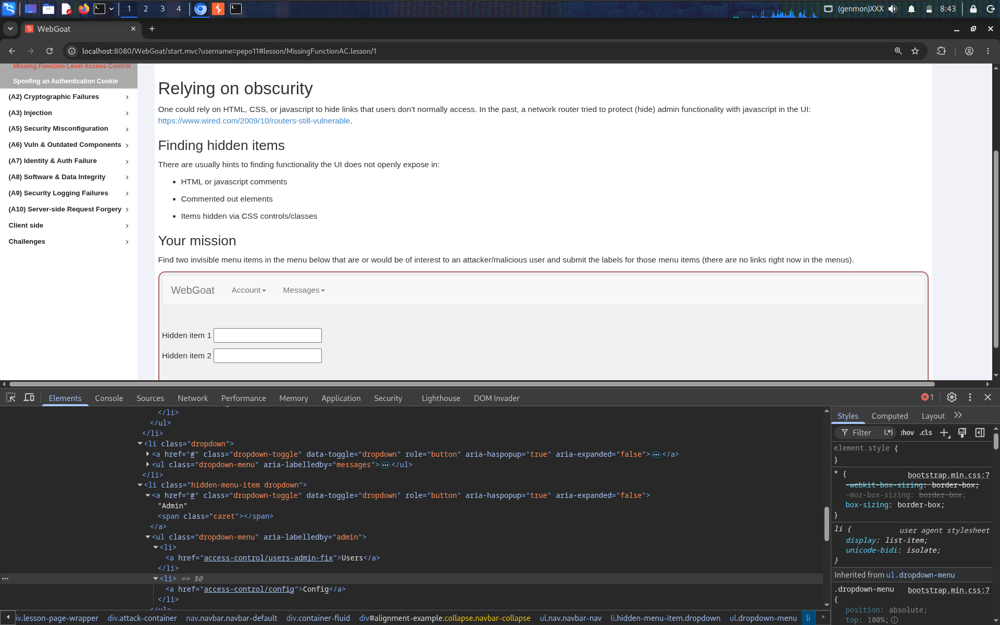

Submitted `Users` and `Config` as the two hidden item labels — correct.

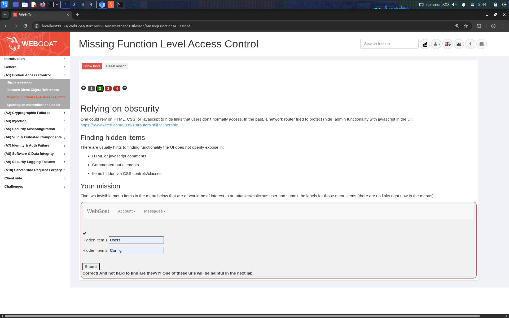

### Stage 2 — Try It: Gathering User Info

Armed with the hint that a "users" endpoint exists, the lesson asks for Jerry's password hash.

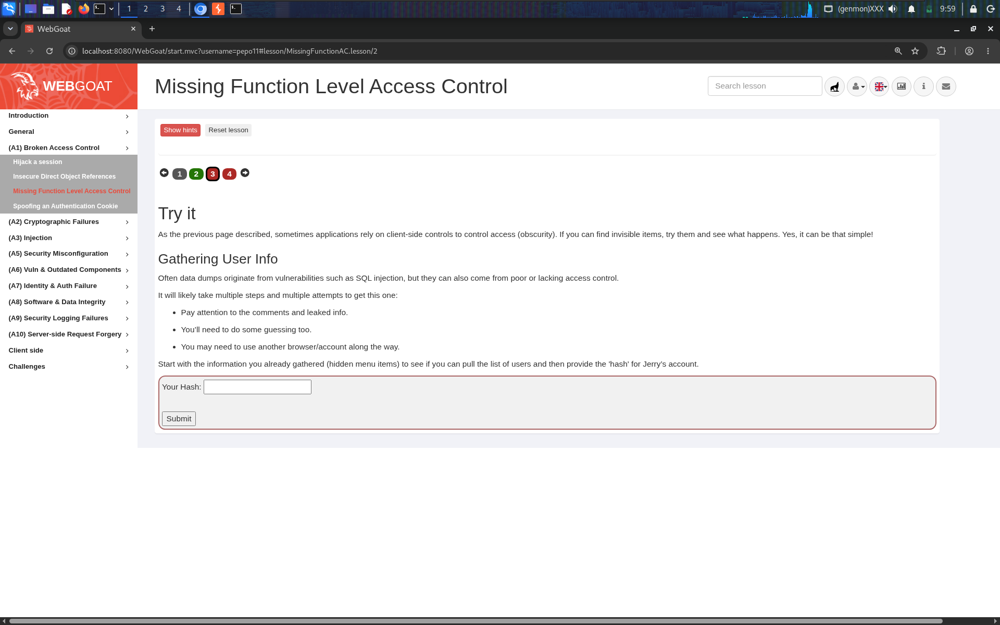

First tried submitting a placeholder value directly to `/WebGoat/access-control/user-hash` — correctly rejected, confirming the endpoint expects a real hash, not an arbitrary guess:

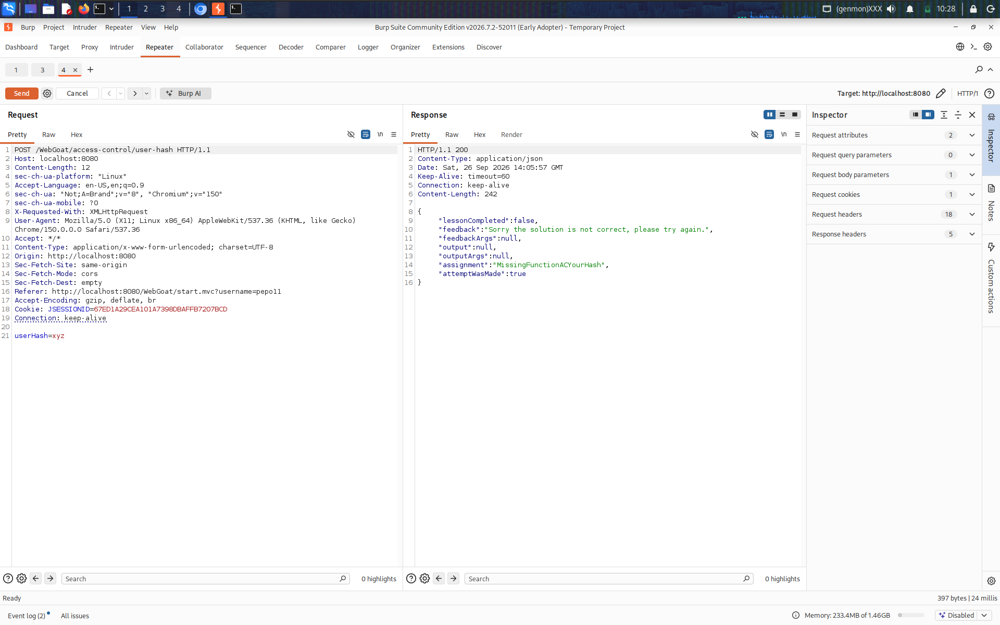

Instead of guessing, I called the related listing endpoint directly — `GET /WebGoat/access-control/users` — with my normal, non-admin session cookie. The server returned the **full user list, including every user's password hash**, with no authorization check on who was allowed to call it:

```json
[
  {"username":"Tom","admin":false,"userHash":"Mydnhcy0Oj2b0m6SjmPz6PUxF9WIeO7tzm665GiZWCo="},
  {"username":"Jerry","admin":true,"userHash":"SVtOlaa+ER+w2eoIIVE5/77umvhcsh5V8UyDLUa1Itg="},
  {"username":"Sylvester","admin":false,"userHash":"B5zhk7OZfZLuvQ4smRl4nqCvdOTggMZtKS3TtTqIedO="},
  {"username":null,"admin":false,"userHash":"C+4PCW3X1y9xHb/pery41w+ziWi2X3JYdSiGzOZQBK8="}
]
```

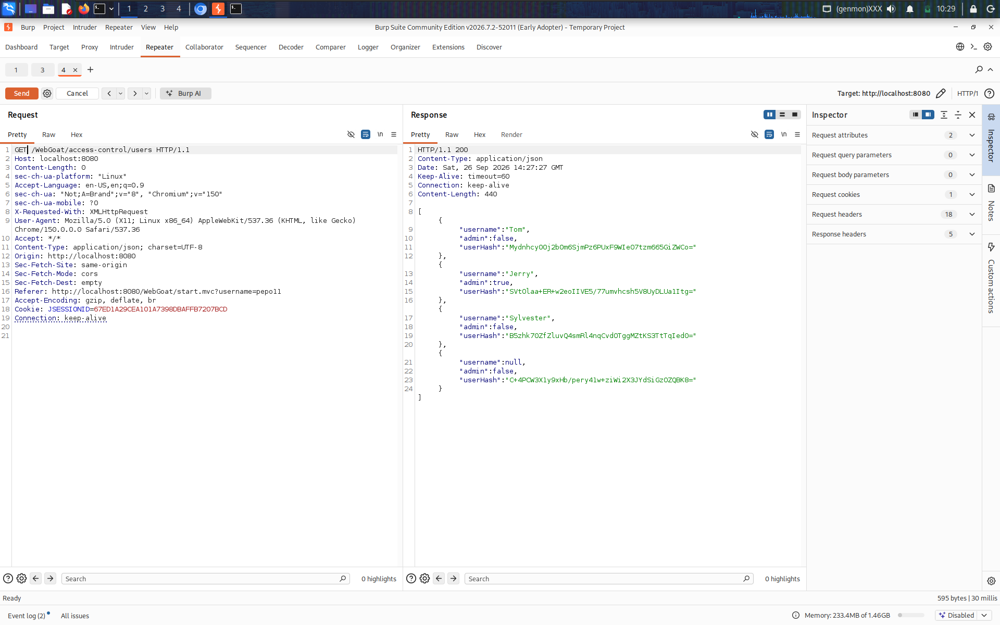

Submitted Jerry's leaked hash — correct, stage complete:

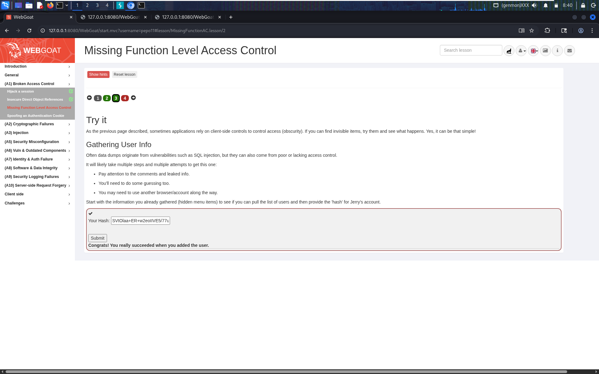

### Stage 3 — "The Company Fixed the Problem, Right?" (Bypassing the Fix via Mass Assignment)

The lesson explains the developers found the endpoint "too open" and applied an emergency fix — implying only admins can list users now.

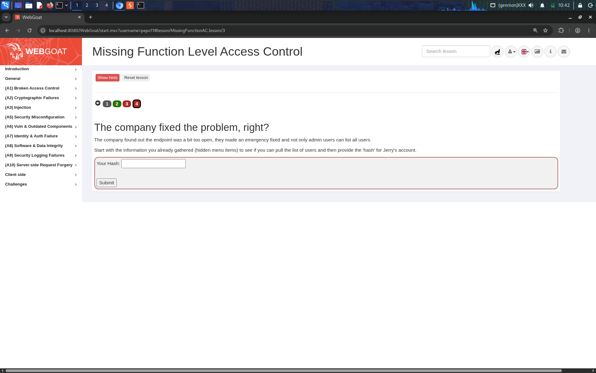

**Step 1 — Probe the "fixed" field.** I first submitted an intentionally junk value (`userHash=xzz`) into the hash field just to observe how the fixed endpoint handles arbitrary input. The response (`"assignment":"MissingFunctionACYourHashAdmin"`) hinted this stage now genuinely requires admin privileges, not just a correct hash:

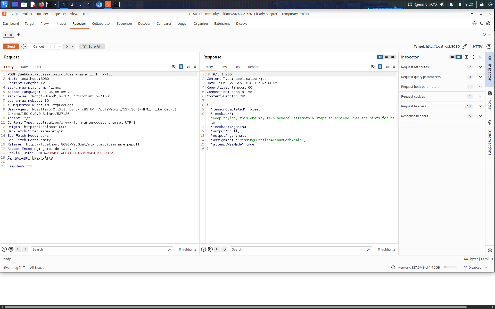

**Step 2 — Pivot the same request to enumerate users.** Rather than starting a fresh request, I took that exact captured request in Burp Repeater and modified it in place: changed the method from `POST` to `GET`, changed the path to `/WebGoat/access-control/users`, and added a `Content-Type: application/json` header. This returned the full user list again — the listing endpoint itself was still not authorization-checked:

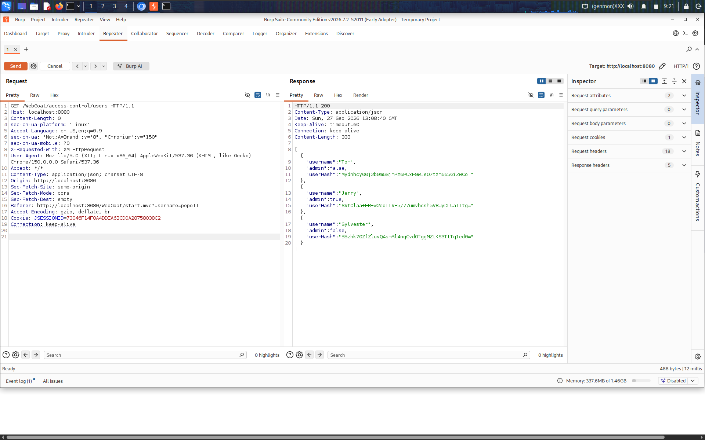

**Step 3 — Test how the server handles attacker-supplied fields.** Using that same `/WebGoat/access-control/users` endpoint, I switched the method back to `POST` and attached a JSON body I crafted myself, including a field a normal client should never be allowed to set:

```http
POST /WebGoat/access-control/users HTTP/1.1
Content-Type: application/json

{"username":"Jerry","admin":true,"password":""}
```

The server responded with success, reflecting the submitted data back rather than rejecting the unexpected `admin` field or stripping it out:

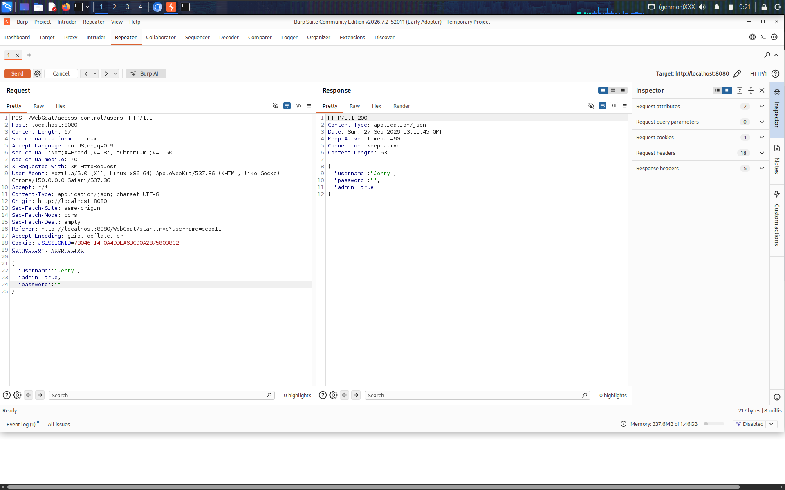

This is the actual signature of a **mass assignment (over-posting) vulnerability**: the endpoint took the entire client-supplied JSON object and bound it directly onto the server-side user model, with no allow-list restricting which fields a client is permitted to set. Because it accepted and processed `admin` — a privileged field that should only ever be set by trusted server logic — the request effectively elevated privileges from the client side.

**Step 4 — Confirm the correct target endpoint via the site map.** Before assuming the escalation had worked, I checked Burp's site map to make sure I'd be hitting the actual protected admin endpoint discovered back in Stage 1, rather than guessing:

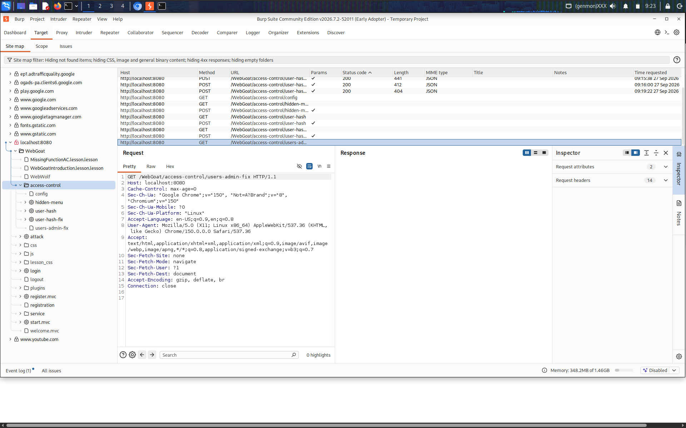

**Step 5 — Hit the real admin endpoint.** With that confirmed, I sent a final `GET` request to `/WebGoat/access-control/users-admin-fix` using the same session. This time it returned the full, now-elevated listing, including an updated entry reflecting the privilege change:

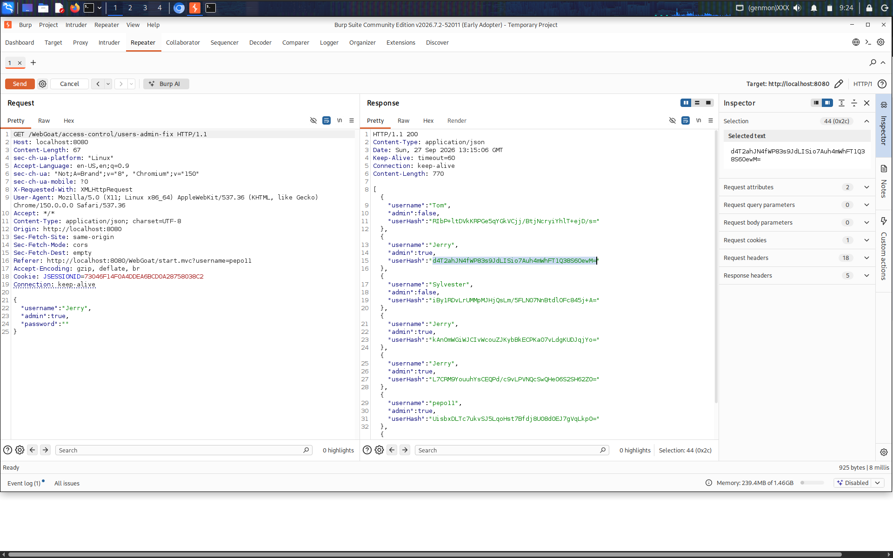

Submitted the new hash (`d4T2ahJN4fWP83s9JdLISio7Auh4mWhFT1Q38S6OewM=`) from that response — correct, lesson complete:

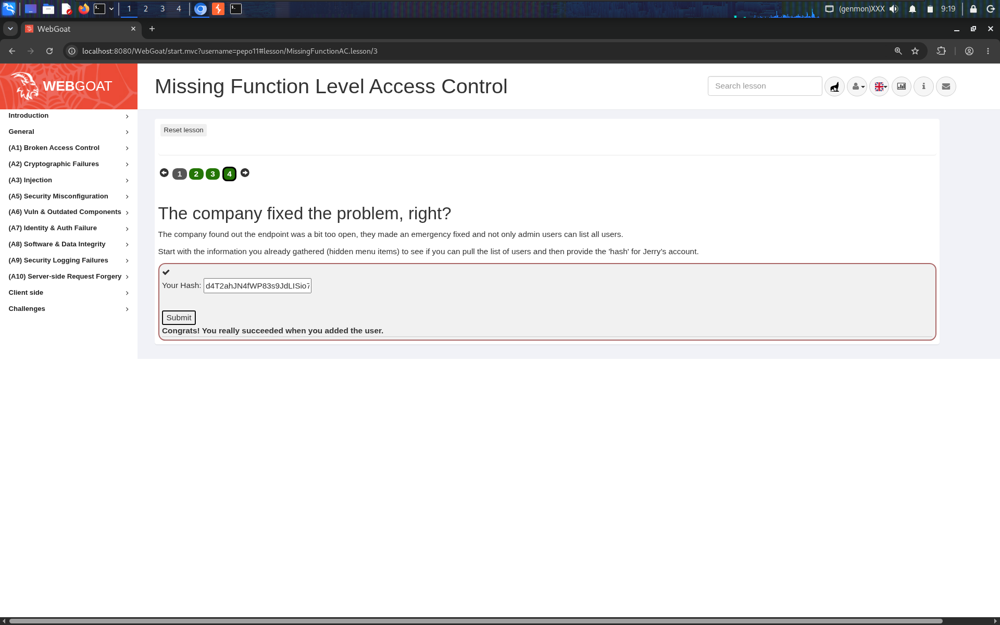

## Why It Worked

- **UI-only access control**: hiding admin links in HTML/CSS/JS does nothing to stop a direct HTTP request to the underlying endpoint — the server must independently verify the caller's role on every request, not just render different menus for different users.
- **Endpoint fixed in isolation**: the developers patched the specific flow that was reported (`user-hash` → `user-hash-fix`) but left a *sibling* endpoint (`/access-control/users`, and the user-update endpoint) with the same missing authorization check — a common real-world pattern where a narrow patch doesn't address the systemic root cause.
- **Mass assignment**: binding an entire client-supplied JSON body directly to an internal data model, without an explicit allow-list of which fields a client is permitted to set, let a normal user flip a privileged `admin` flag on an account — turning a read-only information leak into a full privilege escalation.

## Remediation

- Enforce **role-based authorization server-side** on every sensitive endpoint, independent of whether links are shown in the UI. A missing link is not a security control.
- Apply authorization fixes **consistently across every endpoint that exposes the same data or capability** — audit for sibling/related routes whenever patching a reported vulnerability, not just the one specific URL that was flagged.
- Never bind raw client-supplied JSON directly onto server-side/domain models. Use explicit DTOs (Data Transfer Objects) or allow-lists that only accept the specific fields a client is meant to modify (e.g. `password`, not `admin`).
- Treat privileged fields (roles, permissions, flags like `admin`, `isVerified`, `balance`) as **server-controlled only** — never accept them from client input under any circumstance, regardless of the user's current role.
- Log and alert on privilege-flag changes (e.g., a user's `admin` status flipping to `true`) so unexpected escalations are caught quickly even if the underlying flaw isn't found immediately.

## References

- [OWASP Top 10 2021 – A01: Broken Access Control](https://owasp.org/Top10/A01_2021-Broken_Access_Control/)
- [CWE-285: Improper Authorization](https://cwe.mitre.org/data/definitions/285.html)
- [CWE-915: Improperly Controlled Modification of Dynamically-Determined Object Attributes (Mass Assignment)](https://cwe.mitre.org/data/definitions/915.html)
