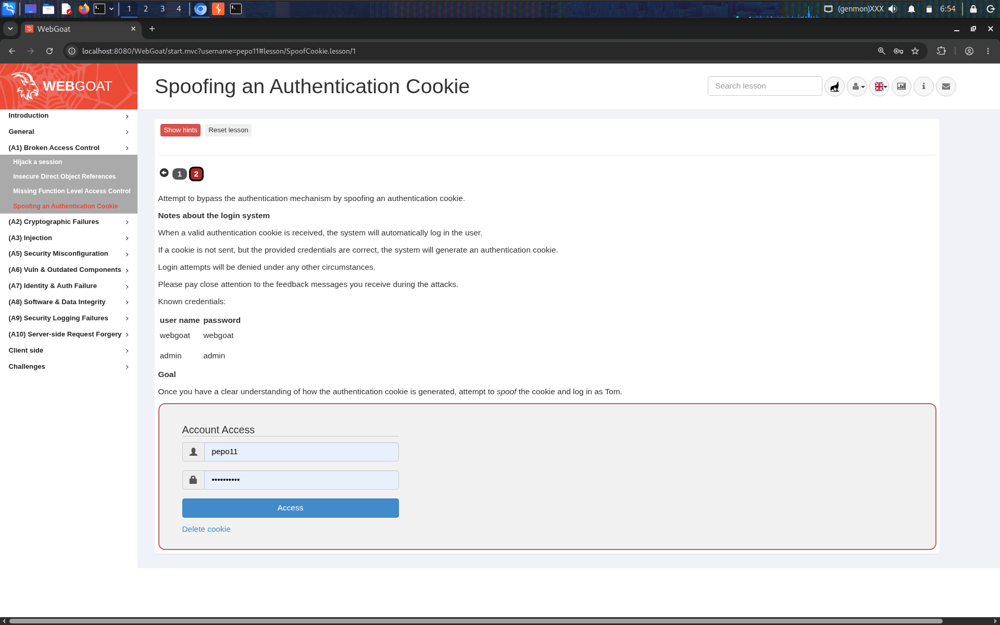
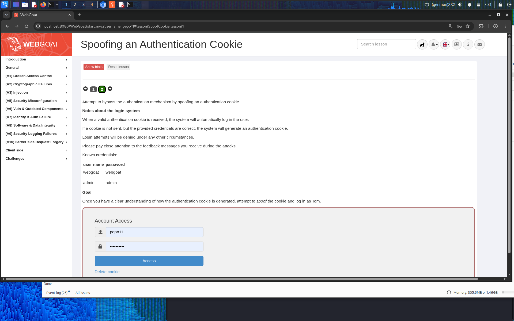
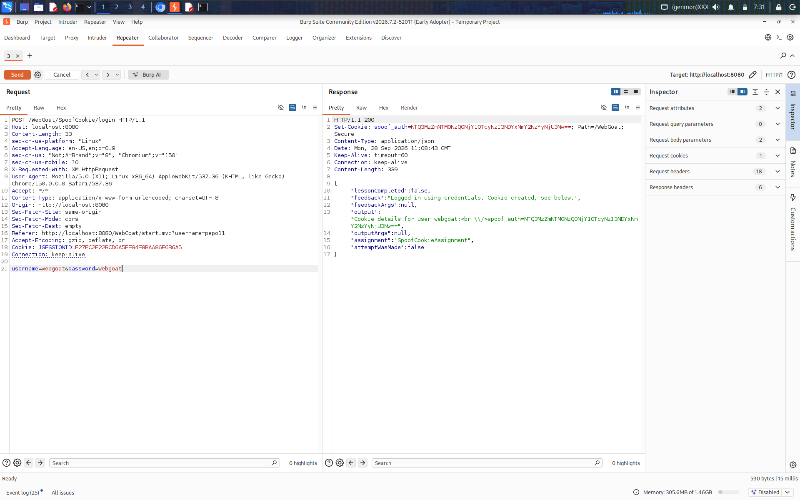
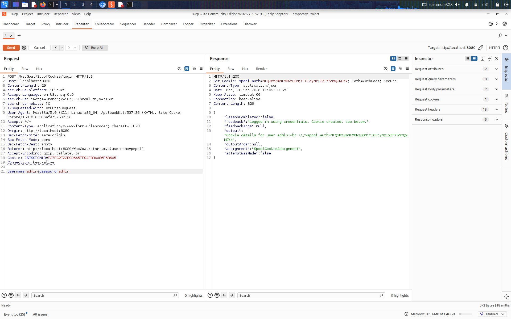
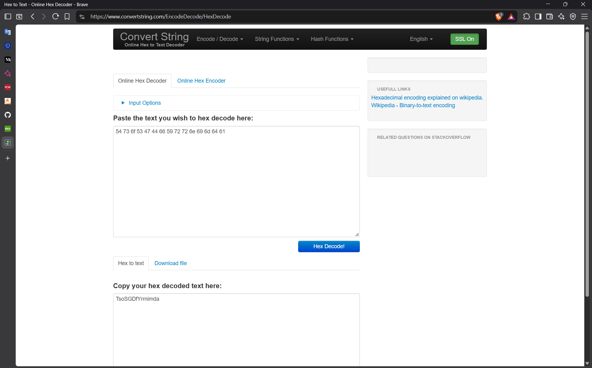
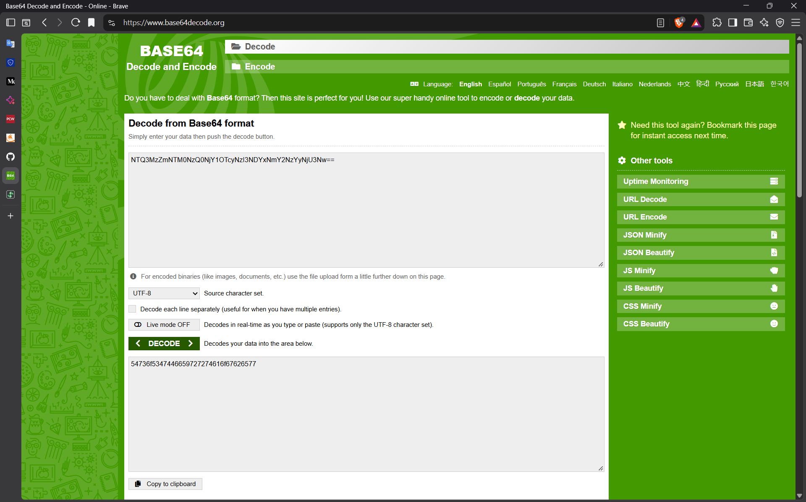
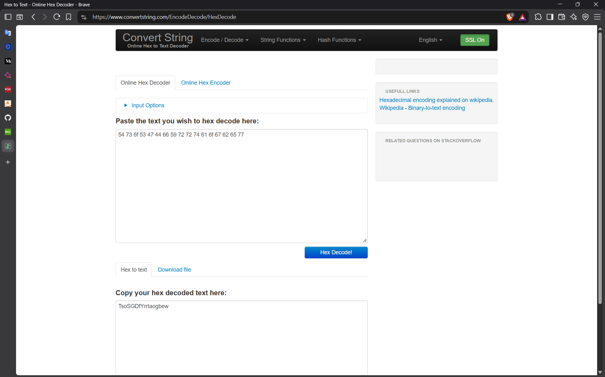
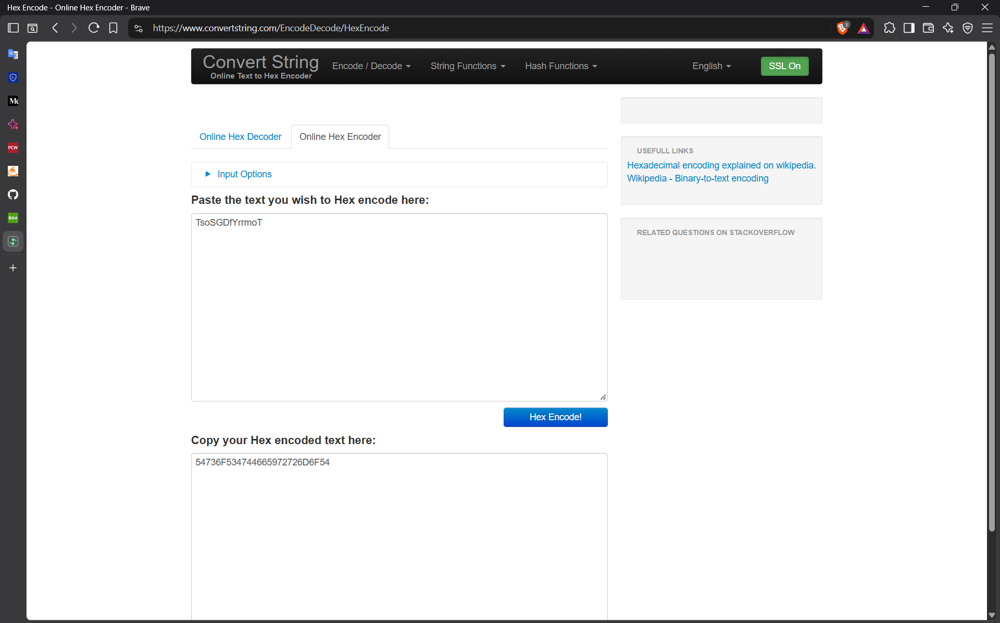
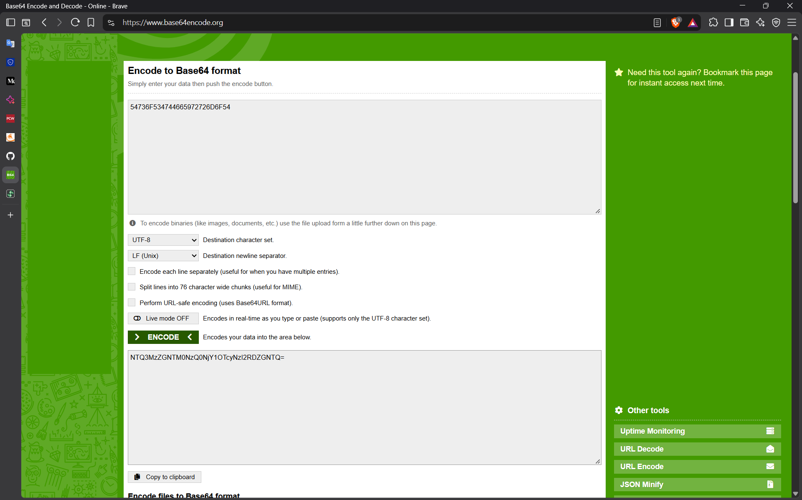
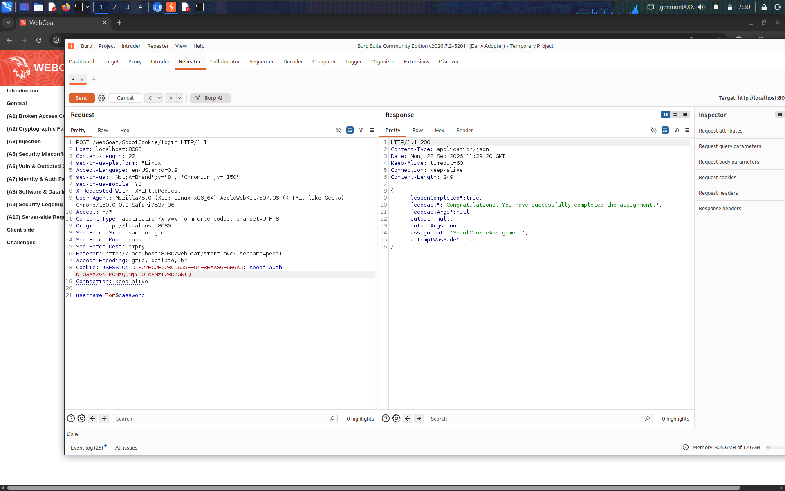

# Spoofing an Authentication Cookie — WebGoat Lesson: A1 Broken Access Control

**Category:** A1 — Broken Access Control
**Difficulty:** Hard

## Objective

WebGoat issues a custom `spoof_auth` cookie on login, separate from the standard `JSESSIONID`. The lesson provides two known sets of credentials (`webgoat`/`webgoat` and `admin`/`admin`) and asks you to reverse-engineer how the `spoof_auth` cookie is generated well enough to **forge a valid cookie for a third user, Tom, without ever knowing Tom's password**.




## Vulnerability

The `spoof_auth` cookie is generated using a **reversible, unkeyed encoding scheme** rather than a proper cryptographic signature (like an HMAC) or an opaque server-side session reference. Because the transformation from username → cookie value is just encoding (not encryption or signing with a secret), anyone who figures out the transformation can run it in reverse and forge a cookie for *any* username — including users they've never authenticated as.

## Exploitation Steps

### Step 1 — Collect known-good cookies

Logged in with each of the two known accounts and captured the `spoof_auth` cookie value issued for each, using Burp Repeater:

**webgoat / webgoat:**


**admin / admin:**


Having two different known usernames mapped to two different cookie values gives enough data to spot a pattern by comparing them side by side.

### Step 2 — Reverse-engineer the encoding

Took the `admin` cookie value and ran it through a **Base64 decoder**, producing a hex-looking string:


Fed that result into a **hex decoder**, which revealed plain ASCII text ending in `...nimda`:



`nimda` is `admin` spelled backwards. Repeated the same two-step decode (Base64 → hex → ASCII) on the `webgoat` cookie:




This decoded to plaintext ending in `...taogbew` — `webgoat` spelled backwards. Both decoded values shared the exact same fixed prefix (`TsoSGDfYrr`) before the reversed username. That confirmed the full scheme:

```
spoof_auth = Base64( Hex( "TsoSGDfYrr" + reverse(username) ) )
```

### Step 3 — Forge a cookie for Tom

To log in as Tom, reversed his username (`Tom` → `moT`) and appended it to the same fixed prefix, giving the plaintext `TsoSGDfYrrmoT`. Hex-encoded that string:



Then Base64-encoded the resulting hex string to produce the final forged `spoof_auth` cookie value:



### Step 4 — Use the forged cookie

Set the newly generated value as the `spoof_auth` cookie in a request's `Cookie` header (alongside the existing session cookie) and sent it to the login endpoint. The server accepted the forged cookie and authenticated the request as Tom — with no password required at all:



## Why It Worked

- **Reversible encoding, not authentication**: Base64 and hex are encodings, not cryptographic protections — they don't require a secret key to reverse. Anyone can decode them, spot the pattern, and re-encode arbitrary input.
- **No secret/signature involved**: a secure design would derive the cookie using a server-side secret (e.g., an HMAC of the username, keyed with a value only the server knows). Without that secret, the entire scheme is just an obfuscation trick, not a security control — trivially reversible once two sample outputs are available to compare.
- **Comparable-samples attack**: having two known username→cookie pairs was enough to isolate a fixed prefix and confirm the transformation (username reversal) purely by observation, with no need to guess or brute-force anything.
- **No server-side validation beyond format-matching**: the server evidently just decodes the cookie and trusts the embedded username, rather than checking it against a signed, server-issued session record.

## Remediation

- Never derive authentication tokens from reversible encodings (Base64, hex, URL-encoding) of predictable input like a username. Encoding provides zero confidentiality or integrity guarantees.
- Use signed tokens (e.g., JWTs signed with a strong server-side secret, or HMAC-based tokens) where the signature cannot be forged without knowledge of the secret key, and verify that signature on every request.
- Prefer fully opaque, random session identifiers (e.g., a random UUID mapped server-side to a session record) over any scheme that encodes user-identifying information directly into the token itself.
- Rotate and safeguard any signing secrets, and ensure token validation logic actually verifies a signature/MAC rather than just checking that the token *decodes* into an expected shape.

## References

- [OWASP Top 10 2021 – A01: Broken Access Control](https://owasp.org/Top10/A01_2021-Broken_Access_Control/)
- [CWE-290: Authentication Bypass by Spoofing](https://cwe.mitre.org/data/definitions/290.html)
- [CWE-347: Improper Verification of Cryptographic Signature](https://cwe.mitre.org/data/definitions/347.html)
